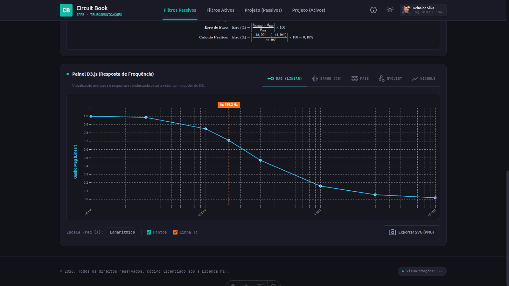
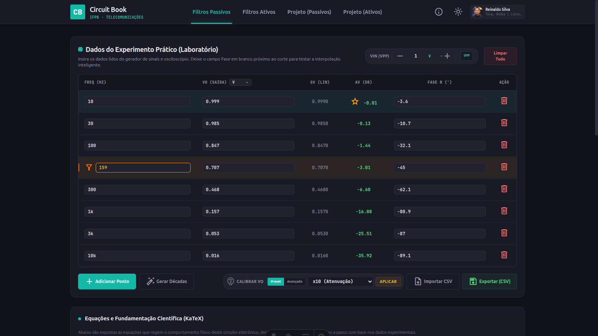
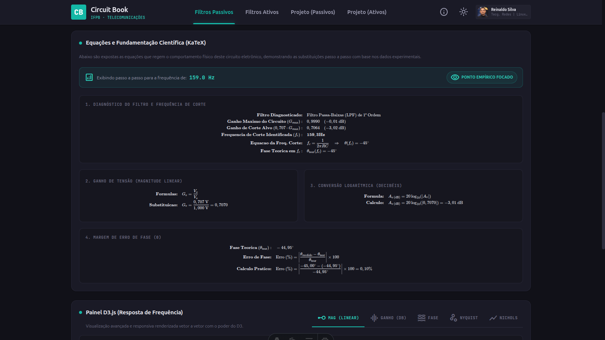

<!-- markdownlint-disable MD033 MD041 -->
<div align="center">

# Circuit Book

## Uma ferramenta feita de estudante para estudante para simplificar o estudo e a bancada de Filtros Analógicos


<br />

[](https://github.com/mr-reinaldo/circuit-book/actions/workflows/deploy.yml)
[](https://vuejs.org/)
[](https://astro.build/)
[](https://d3js.org/)
[](LICENSE)

<br />

🚀 **Acesse o aplicativo ao vivo:**
[mr-reinaldo.github.io/circuit-book](https://mr-reinaldo.github.io/circuit-book)

</div>

---

## 📖 Sobre o Projeto

O **Circuit Book** é uma ferramenta que criamos com o objetivo de ajudar a nós mesmos, aos nossos colegas de turma do curso superior de tecnologia em Sistemas de Telecomunicações do Instituto Federal da Paraíba (IFPB) e a todas as turmas que ainda virão.

A ideia é descomplicar a vida na bancada do laboratório! Em vez de brigar com planilhas de Excel complexas ou gastar tempo plotando gráficos na mão nos relatórios, desenvolvemos este analisador interativo. Você só precisa digitar as frequências e as tensões que lê diretamente no osciloscópio para ver o **Diagrama de Bode (Módulo e Fase)** sendo plotado automaticamente em escala semi-logarítmica, comparando na hora os seus dados experimentais com as curvas teóricas esperadas[^1].

---

## 📐 A Matemática por Trás (Fundamentação Teórica)

Para fazer a comparação das curvas no gráfico e gerar os cálculos passo a passo dos relatórios, implementamos as equações clássicas de resposta em frequência baseadas na transformada de Laplace ($s = j\omega$). Se precisar revisar a teoria de cada circuito, aqui está o resumo das equações que a plataforma usa por trás dos panos[^2][^3]:

### 1. Filtros Passivos de 1ª Ordem (RC e RL)[^4]

A frequência de corte nominal ($f_c$) para circuitos compostos por uma malha de impedâncias reativas simples é dada por:

$$f_c = \frac{1}{2\pi R C} \quad \text{(Filtros RC)} \qquad \text{ou} \qquad f_c = \frac{R}{2\pi L} \quad \text{(Filtros RL)}$$

A resposta em frequência para a tensão de saída é governada pelas funções de transferência:

* **Passa-Baixas (LPF):**
  $$H(j\omega) = \frac{1}{1 + j(\omega/\omega_c)} \quad \Rightarrow \quad |H(f)| = \frac{1}{\sqrt{1 + (f/f_c)^2}}$$
  $$\theta(f) = -\arctan\left(\frac{f}{f_c}\right)$$
  Na frequência de corte ($f = f_c$), a atenuação teórica é de $-3,01 \text{ dB}$ (fator de ganho de $1/\sqrt{2} \approx 0,7071$) e o atraso de fase é de $\theta(f_c) = -45^\circ$.

* **Passa-Altas (HPF):**
  $$H(j\omega) = \frac{j(\omega/\omega_c)}{1 + j(\omega/\omega_c)} \quad \Rightarrow \quad |H(f)| = \frac{(f/f_c)}{\sqrt{1 + (f/f_c)^2}}$$
  $$\theta(f) = 90^\circ - \arctan\left(\frac{f}{f_c}\right) = \arctan\left(\frac{f_c}{f}\right)$$
  Na frequência de corte ($f = f_c$), a atenuação teórica é de $-3,01 \text{ dB}$ e o adiantamento de fase é de $\theta(f_c) = 45^\circ$.

---

### 2. Filtros Passivos de 2ª Ordem (Efeito de Carga / Loading Effect)

Quando cascateamos duas malhas RC idênticas sem usar um amplificador de isolamento (buffer), a segunda malha puxa corrente da primeira e altera a resposta do circuito. Para evitar que os relatórios deem valores errados na teoria, o **Circuit Book** calcula o efeito de carga real:

A função de transferência real com efeito de carga para o circuito passa-baixas cascateado é:

$$H_2(s) = \frac{1}{s^2 R^2 C^2 + 3sRC + 1}$$

A frequência de corte sob carga ($f_{c,\text{carga}}$) afasta-se da frequência nominal ($f_{c,\text{nom}} = \frac{1}{2\pi R C}$). Fazendo-se $y = (\omega_c R C)^2$, resolve-se a equação característica de amplitude:

$$|H_2(f_c)|^2 = \frac{1}{2} \quad \Rightarrow \quad y^2 + 7y - 1 = 0 \quad \Rightarrow \quad y \approx 0,13998$$

Substituindo de volta na relação de frequência angular:

$$f_{c,\text{carga}} = \frac{\sqrt{y}}{2\pi R C} \approx 0,3742 \cdot f_{c,\text{nom}}$$

O atraso de fase teórica sob carga na frequência de corte real é dado por:

$$\theta(f_{c,\text{carga}}) = -\arctan\left(\frac{3\omega R C}{1 - \omega^2 R^2 C^2}\right) \approx -52,55^\circ$$

Para filtros passa-altas de 2ª ordem idênticos sob efeito de carga, a relação é:

$$f_{c,\text{carga}} \approx 2,672 \cdot f_{c,\text{nom}} \qquad \text{e} \qquad \theta(f_{c,\text{carga}}) \approx 52,55^\circ$$

---

### 3. Filtros Ativos de 2ª Ordem (Topologia Sallen-Key)[^5]

Estes circuitos utilizam amplificadores operacionais para isolar as malhas RC e permitir que apliquemos ganho de tensão. Para a topologia Sallen-Key que estudamos e usamos na ferramenta:

$$f_c = \frac{1}{2\pi \sqrt{R_1 R_2 C_1 C_2}}$$

Se os componentes forem casados ($R_1 = R_2 = R$ e $C_1 = C_2 = C$), a resposta de fase teórica em $f_c$ converge exatamente para:

* **Passa-Baixas:** $\theta(f_c) = -90^\circ$
* **Passa-Altas:** $\theta(f_c) = 90^\circ$

## 📊 Estrutura das Tabelas e Como os Cálculos são Feitos

Dividimos o analisador em duas páginas principais (uma para filtros passivos e outra para ativos), pois cada experimento de laboratório exige medições e cálculos específicos:

### 1. Módulo de Filtros Passivos (RC, RL, RLC)

Este painel serve para os circuitos passivos mais simples, focando na medição direta da tensão de entrada e saída.

* **O que você coloca na tabela (Colunas):**
  * **Frequência ($f$):** A frequência gerada pela fonte alternada em Hertz ($\text{Hz}$).
  * **Tensão de Saída ($V_o$):** A tensão de pico a pico que você lê no osciloscópio sobre a carga/saída ($\text{V}$).
  * **Fase ($\theta$, opcional):** O ângulo de fase medido entre a entrada e a saída ($^\circ$).
* **Parâmetro Global (Ajustado no topo da página):**
  * **Tensão de Entrada ($V_s$):** A tensão pico a pico que vem do gerador de sinais ($\text{V}$).
* **Fórmulas que o sistema calcula para você:**
  * **Conversão para Tensão Eficaz (RMS):**
    $$V_{o\text{ (rms)}} = \frac{V_o}{2\sqrt{2}}$$
  * **Ganho de Amplitude Linear ($G_v$):**
    $$G_v = \frac{V_{o\text{ (rms)}}}{V_{s\text{ (rms)}}}$$
  * **Ganho Logarítmico em Decibéis ($G_{v\text{ (dB)}}$):**
    $$G_{v\text{ (dB)}} = 20 \log_{10}(G_v) = 20 \log_{10}\left(\frac{V_o}{V_s}\right)$$
  * **Incerteza/Erro Relativo de Fase (%):**
    $$\text{Erro (\%)} = \left| \frac{\theta_{medido} - \theta_{\text{teor}}}{\theta_{\text{teor}}} \right| \times 100$$

### 2. Módulo de Filtros Ativos (Amp-Op / Sallen-Key)

Em circuitos com amplificadores operacionais, pode haver pequenos desvios de offset DC ou ganhos altos de sinal. Para garantir maior precisão, em vez de pedir a tensão pico a pico direto, a tabela pede os extremos superior e inferior da senóide.

* **O que você coloca na tabela (Colunas):**
  * **Frequência ($f$):** A frequência configurada no gerador de sinais ($\text{Hz}$).
  * **Tensão Máxima ($V_{max}$):** O topo mais alto (pico positivo) da onda senoidal de saída ($\text{V}$).
  * **Tensão Mínima ($V_{min}$):** A base mais baixa (pico negativo) da onda senoidal de saída ($\text{V}$).
  * **Fase ($\theta$, opcional):** A diferença de fase medida no osciloscópio ($^\circ$).
* **Parâmetro Global (Ajustado no topo da página):**
  * **Tensão de Entrada ($V_{in}$):** A amplitude pico a pico do gerador na entrada do amplificador ($\text{V}$).
* **Fórmulas que o sistema calcula para você:**
  * **Cálculo da Amplitude Pico-a-Pico de Saída ($V_{out\text{ (pp)}}$):**
    $$V_{out\text{ (pp)}} = |V_{max} - V_{min}|$$
  * **Conversão para Tensão Eficaz de Saída ($V_{out\text{ (rms)}}$):**
    $$V_{out\text{ (rms)}} = \frac{V_{out\text{ (pp)}}}{2\sqrt{2}}$$
  * **Ganho de Amplitude Linear ($A_v$):**
    $$A_v = \frac{V_{out\text{ (pp)}}}{V_{in\text{ (pp)}}} = \frac{V_{out\text{ (rms)}}}{V_{in\text{ (rms)}}}$$
  * **Ganho Logarítmico em Decibéis ($A_{v\text{ (dB)}}$):**
    $$A_{v\text{ (dB)}} = 20 \log_{10}(|A_v|)$$
  * **Incerteza/Erro Absoluto de Fase (Graus):**
    Esta métrica quantifica o afastamento angular absoluto para evitar instabilidades próximas a passagens por zero e inversões de fase de $180^\circ$:
    $$\theta_{\text{erro}} = |\theta_{medido} - \theta_{\text{teor}}|$$

---

## 📸 Conhecendo a Interface

### 1. Gráficos em Escala Semi-Logarítmica

Tivemos o cuidado de projetar os gráficos via D3.js para que ficassem idênticos ao "papel semi-logarítmico" real que costumamos utilizar nas aulas teóricas e relatórios.



### 2. Tabela e Calibração Rápida

Além de digitar os dados de bancada, colocamos um botão de "Gerar Décadas" (para preencher as frequências padrão rapidamente) e um seletor de calibração (caso a medição tenha sido feita com ponta de prova de atenuação x10).



### 3. Passo a Passo Matemático

Para nos ajudar a entender onde estamos errando ou acertando, a página calcula o passo a passo matemático usando KaTeX para exibir as equações do filtro conforme os componentes que você escolhe na simulação.



---

## 🛠️ O que Usamos para Desenvolver (Stack Tecnológica)

Para manter o site super leve e rápido para carregar no celular de qualquer colega no meio do laboratório, utilizamos a arquitetura moderna de ilhas (*Islands Architecture*):

* **Astro.build** - Estrutura principal do site e roteamento rápido.
* **Vue 3 (Composition API)** - Toda a interatividade da tabela de dados, calibração e equações dinâmicas.
* **D3.js** - Biblioteca de alta performance para desenhar as curvas do gráfico vetorial (SVG).
* **KaTeX** - Renderização instantânea das fórmulas matemáticas.
* **Tailwind CSS v4** - Estilos visuais e transição suave do tema claro e escuro.
* **Vitest** - Ferramenta de testes de código para garantir que nenhuma fórmula quebre após atualizações.

---

## 🚀 Como Rodar o Projeto na sua Máquina?

Se você quiser baixar o projeto para estudar o código ou fazer melhorias, siga estes passos:

### Pré-requisitos

* **Node.js** instalado (se puder, use a versão `>= 22.12.0`)
* **pnpm** (gerenciador de pacotes rápido que usamos para as dependências)

### Passo a Passo

1. **Faça o clone do repositório no seu computador:**

   ```bash
   git clone https://github.com/mr-reinaldo/circuit-book.git
   cd circuit-book
   ```

2. **Instale os pacotes necessários:**

   ```bash
   pnpm install
   ```

3. **Inicie o servidor de desenvolvimento local:**

   ```bash
   pnpm run dev
   ```

   Depois, basta abrir no seu navegador o endereço local `http://localhost:4321/circuit-book`

4. **Para rodar os testes automáticos de equações:**

   ```bash
   pnpm run test
   ```

---

## 📚 Referências Bibliográficas

[^1]: **AMORIM, Henrique.** *Seletores de Frequência III: Curvas de Bode – Ganho de Tensão*. São José dos Campos: UNIFESP - ICT. Disponível em: <https://www.amorim.eng.br/aulasCE2/pdf_aulas/aula_17-18_Seletores3.pdf>. Acesso em: 4 jun. 2026.
[^2]: **ELECTRONICS TUTORIALS.** *Passive Filters including Low Pass, High Pass and Band Pass Filters*. Disponível em: <https://www.electronics-tutorials.ws/filter>. Acesso em: 4 jun. 2026.
[^3]: **UNIVERSIDADE DA MADEIRA (UMA).** *Filtros Analógicos*. Madeira: UMA. Disponível em: <http://cee.uma.pt/edu/el2/acetatos/filtros1.pdf>. Acesso em: 4 jun. 2026.
[^4]: **ELECTRICAL TECHNOLOGY.** *Passive Low Pass Filter – RL and RC Passive Filters*. Disponível em: <https://www.electricaltechnology.org/2019/01/passive-low-pass-filter-types.html>. Acesso em: 4 jun. 2026.
[^5]: **LIMA, Manoel Eusebio de.** *Eletrônica: Introdução a Filtros Ativos*. Recife: UFPE - CIn. Disponível em: <https://www.cin.ufpe.br/~es238/arquivos/aulas/aula_filtros.pdf>. Acesso em: 4 jun. 2026.

---

## ⚖️ Termos de Uso e Licença

O projeto é aberto sob a **Licença MIT**. Sinta-se totalmente livre para usar nas aulas, compartilhar com a turma, clonar para fazer novos projetos ou propor melhorias para o código! Veja o arquivo [LICENSE](LICENSE) para mais informações.

---

> Criado com muito ☕, dedicação e carinho para a comunidade acadêmica do Instituto Federal da Paraíba (IFPB) - Campus João Pessoa.
